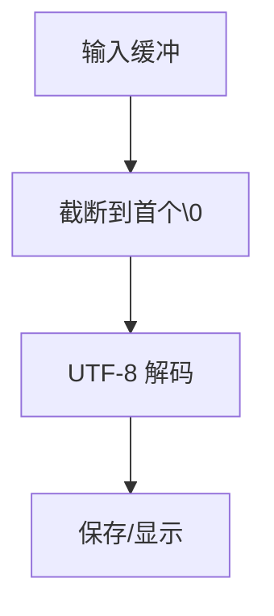

# 方案名称: 修复显示名称清空残留字符

## 方案概述
### 当前方案
- 解析 ImGui 输入缓冲时，遇到首个 '\0' 即截断，再进行 UTF-8 解码
- 统一 InputText 与 InputTextMultiline 的解码行为，覆盖显示名称与自定义图标路径等输入
- 保存自定义图标路径时，空值按未设置处理并清理相关缓存

### 备选方案
- 每次输入后手动清空缓冲区再拷贝原值（实现复杂）
- 使用 InputTextCallbackResize 让 ImGui 直接写入 string（改动较大）

## 方案流程图

## 方案 ADR
无需新增 ADR。

## API 变更
- 无

## 数据变更
- 无

## 兼容性
- 兼容现有配置与显示名/图标回退逻辑

## 回滚方案
- 恢复原有 TrimEnd 解码方式
