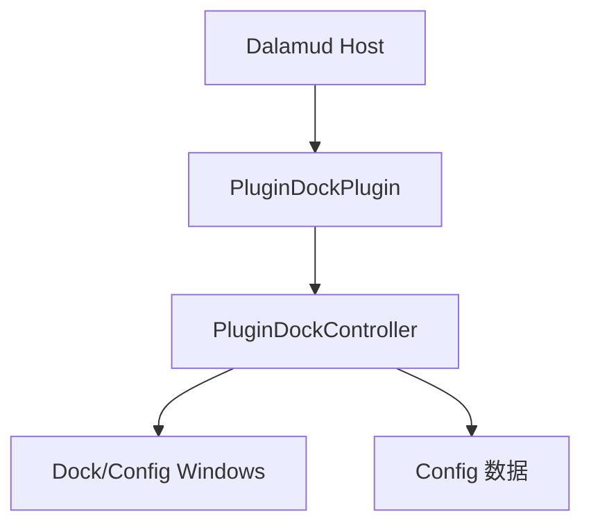
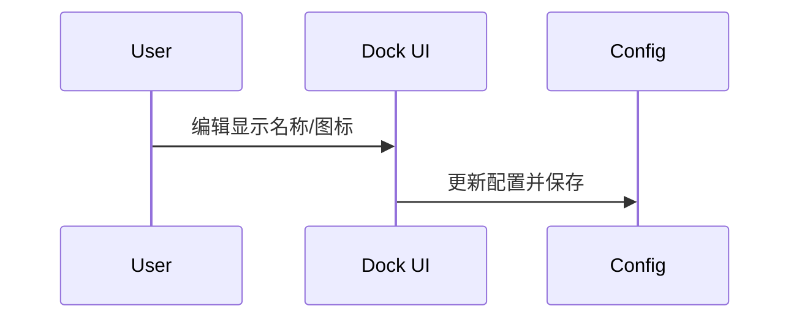

# 架构说明

## 总览

## 关键依赖
- **UI:** ImGui (Dalamud.Bindings.ImGui)
- **配置:** Dalamud IPluginConfiguration
- **资源:** 本地文件与可选网络图标

## 交互流程

## 架构决策记录
暂无 ADR 记录。

| adr_id | title | date | status | affected_modules | details |
|--------|-------|------|--------|------------------|---------|
